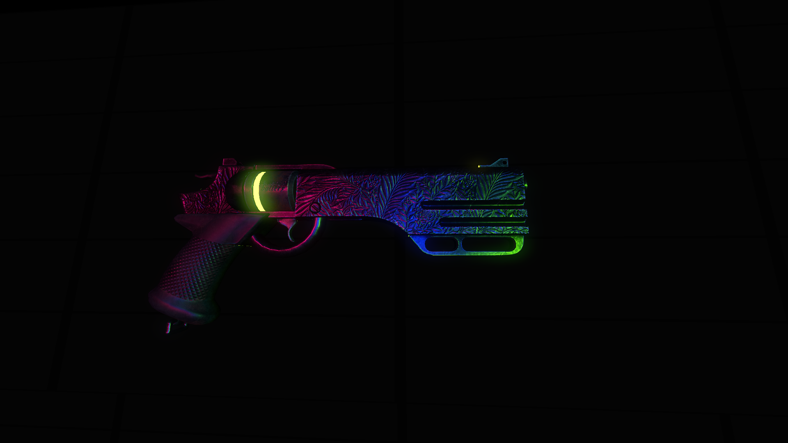
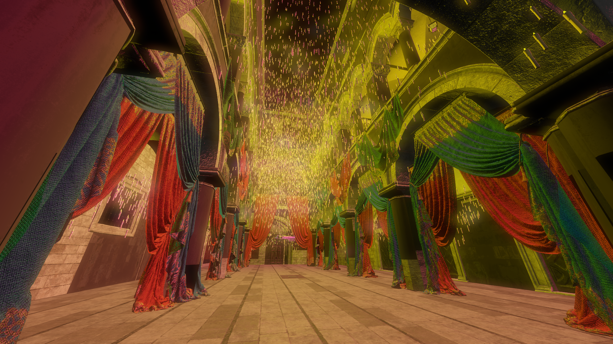
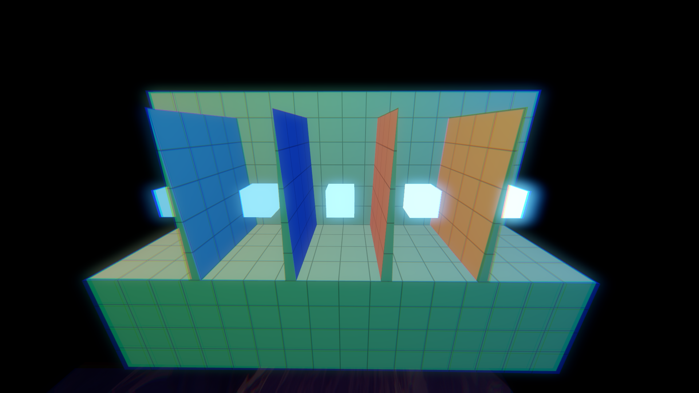
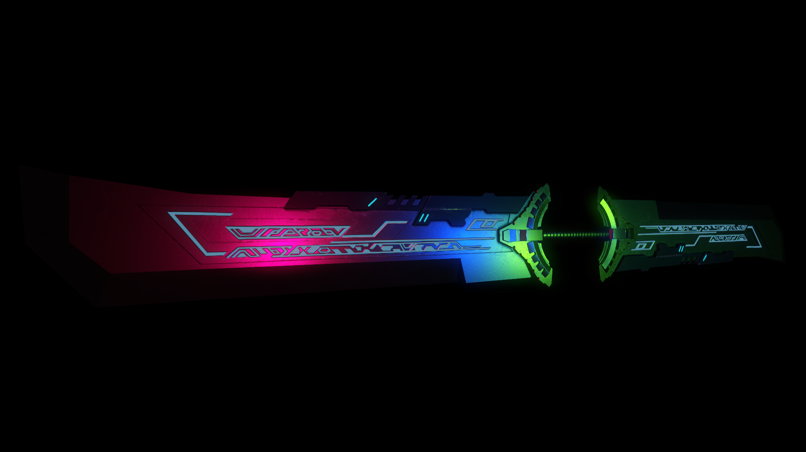

# Curloz Engine

A Vulkan 1.3 game engine written in C++23, built from scratch with a data-oriented design philosophy.

Curloz Engine is the foundation for [Project Name / horror train sim], and eventually the base for future titles. It's under active solo development.

<!--
Badges (uncomment and fill in once you have a CI pipeline set up):


-->

---


## Tech Stack

| System        | Library        | Status        |
| ------------- | -------------- | ------------- |
| Renderer      | Vulkan 1.3     | Implemented   |
| Windowing     | GLFW           | Implemented   |
| ECS           | clz::ecs       | Implemented (self-authored) |
| Math          | clz::math      | Implemented (self-authored) |
| Model Loading | fastgltf       | Implemented   |
| Physics       | Box3D          | Planned       |
| Audio         | OpenAL Soft    | Planned       |
| Animation     | ozz-animation  | Planned / WIP |
| Build System  | CMake + Ninja / Visual Studio (via CMake Presets) | —             |

---

## Prerequisites

### Linux

* Vulkan 1.3 capable GPU and drivers
* CMake 3.25+
* Ninja
* clang-format (for code style enforcement)
* GCC 13+ or Clang 17+ with C++23 support

On Gentoo:

```bash
sudo emerge -av cmake ninja clang dev-util/vulkan-tools
```

On Ubuntu/Debian:

```bash
sudo apt install cmake ninja-build clang-format vulkan-tools libvulkan-dev
```

### Windows

* CMake 3.25+
* Ninja
* Vulkan SDK from [lunarg.com](https://vulkan.lunarg.com)
* MSVC 19.38+ (Visual Studio 2022 17.8+) or MinGW using GCC 13+

---

## Building

The project uses [CMake Presets](CMakePresets.json) to configure builds, so you don't need to pass generator/architecture flags manually — the right preset picks those up for your platform.

```bash
# Clone with submodules
git clone --recursive https://github.com/curloz123/curloz-engine.git
cd curloz-engine

# If you forgot --recursive
git submodule update --init --recursive

# List available presets
cmake --list-presets

# Configure (pick the preset for your platform)
cmake --preset "Linux EngineDebug"      # Linux
cmake --preset "Windows x64"            # Windows

# Build (pick the matching build preset)
cmake --build --preset "Linux EngineDebug"
```

Available configure presets: `Windows x64` (Windows) and `Linux EngineDebug` / `Linux EngineRelease` / `Linux GameDebug` / `Linux GameRelease` (Linux). Build presets mirror these, with `Windows EngineDebug` / `Windows EngineRelease` / `Windows GameDebug` / `Windows GameRelease` selecting the configuration under the Windows configure preset.

- **Engine** builds target engine development; **Game** builds target the shipped game itself.
- Linux binaries land at `build/linux/<preset-name>/`; Windows binaries land at `build/win/Windows x64/<configuration>/`.

Having build issues? See [docs/CONTRIBUTING.md](CONTRIBUTING.md) for troubleshooting (Vulkan SDK detection, missing submodules, compiler mismatches, and more).

## Project Structure

```text
curloz-engine/
├── src/                # Source files (.cpp)
├── include/            # Header files (.hpp)
├── shaders/            # GLSL shaders, compiled to .spv
├── assets/             # Models, textures, audio
├── external/           # Git submodules (do not modify manually)
├── core/               # Utility functions, basically helpers used in entire engine
├── docs/               # Additional documentation (build troubleshooting, images, etc.)
├── .clang-format       # clang-format configuration
├── .editorconfig       # editorconfig configuration
├── CMakeLists.txt      # CMake build configuration
├── CMakePresets.json   # Platform/config build presets
└── LICENSE             # License file
```

---

## Roadmap

* [ ] Display model component's Node → Mesh → Primitives hierarchy in editor's inspector
* [ ] Box3D physics integration
* [ ] OpenAL Soft audio system
* [ ] ozz-animation skeletal animation support
* [ ] Editor UI improvements

<!-- Add/reorder items as priorities shift — a single-item to-do reads as stale, so keep this list populated. -->

---

## Gallery


[Revolver Black Rose](https://sketchfab.com/3d-models/revolver-black-rose-44448687a44d45afb67ed5882edde3b4) by [@SGTIncogniTO](https://sketchfab.com/SGTIncogniTO).


[Sponza](https://www.intel.com/content/www/us/en/developer/topic-technology/graphics-research/samples.html) by Intel.


[Emissive Strength Test](https://github.com/KhronosGroup/glTF-Sample-Assets/tree/main/Models/EmissiveStrengthTest) from Khronos Group / glTF-Sample-Assets.


[Thanos's Infinity Sword](https://sketchfab.com/3d-models/thanos-infinity-sword-with-emission-43cb592807f34a77b97e8e81466456e8) by [@ikhlasfathoni](https://sketchfab.com/ikhlasfathoni).


---

## Want to Contribute?

Contributors are always welcome! If you feel there is any issue, or think there's something that can either be added or be better, feel free to open an issue or submit a pull request.

If you think you can handle a subsystem for the long term, reach out and it will be assigned to you.

For more details, see [CONTRIBUTING.md](CONTRIBUTING.md).

## License

MIT
